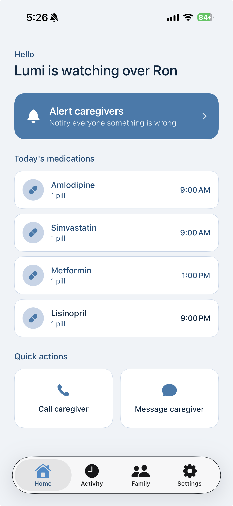
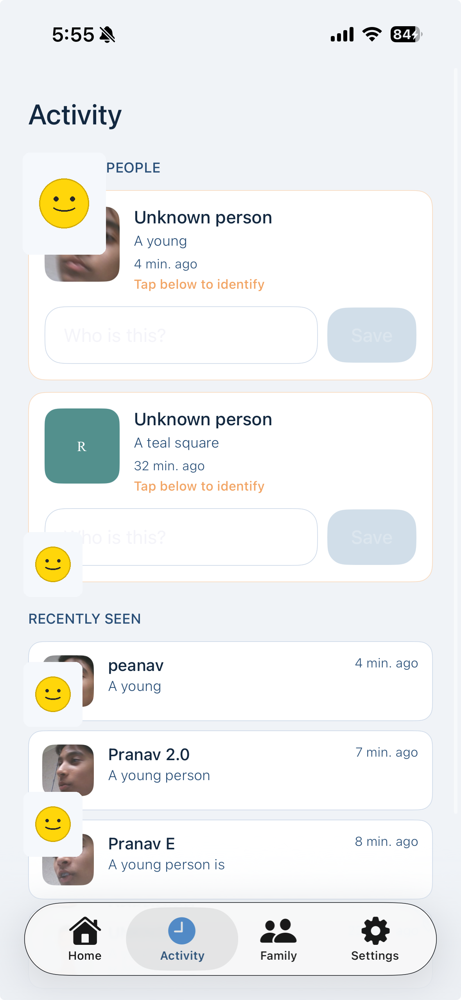
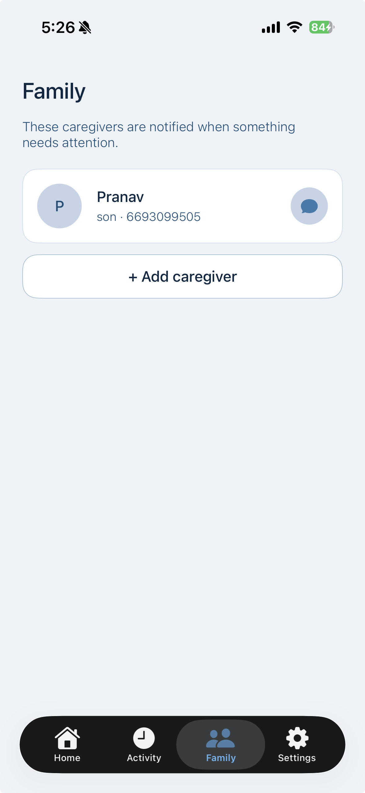
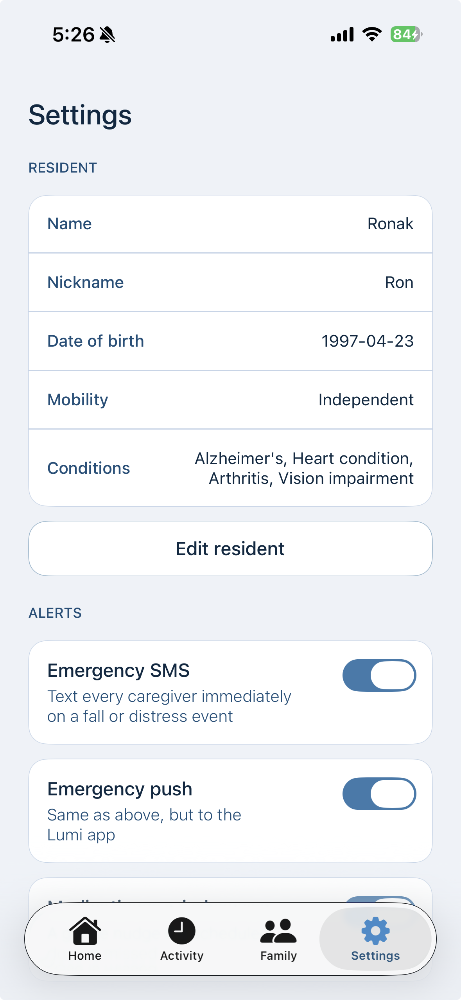

# Lumi AI

An AI care companion for elderly residents that watches, listens, and protects when you can't be there.

Built in one day at **Synthesis Hacks** (May 23, 2026 · Google Humboldt, Sunnyvale, CA).

---

## The Problem

Elderly residents living alone or in care facilities are vulnerable in the gaps between caregiver check-ins. Falls go unnoticed. Strangers enter rooms undetected. Medication gets missed. Families have no visibility into what's happening day-to-day.

## What Lumi Does

Lumi AI turns a camera and a phone into a 24/7 care layer:

- **Fall detection** — flags when a resident falls and alerts caregivers instantly
- **Face recognition** — knows who belongs in the room and flags unknown visitors
- **Medication reminders** — keeps residents on schedule without caregiver intervention
- **Caregiver dashboard** — real-time status, activity feed, and emergency contacts in one place
- **Family notifications** — SMS and push alerts so families stay in the loop remotely

## Demo

| Caregiver Home | Activity Feed | Family Contacts | Resident Settings |
|---|---|---|---|
|  |  |  |  |

## Tech Stack

| Layer | Tech |
|---|---|
| iOS caregiver 
